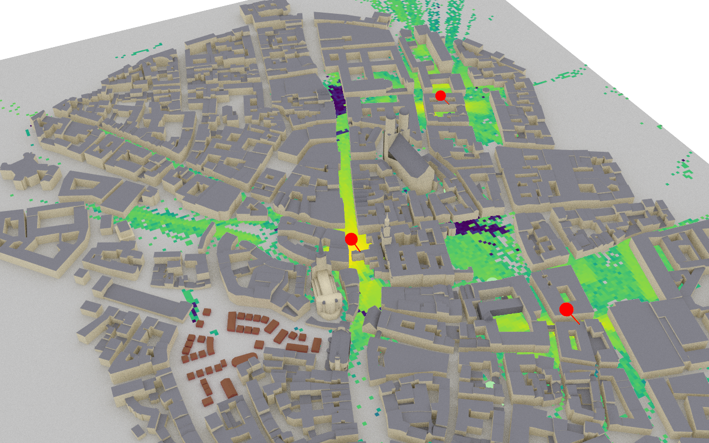
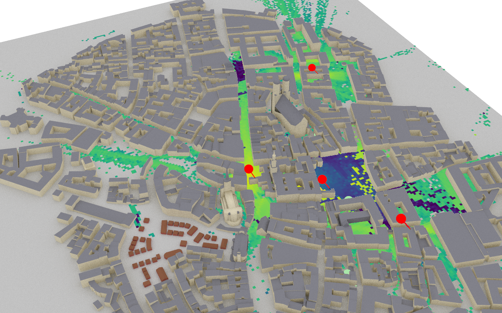
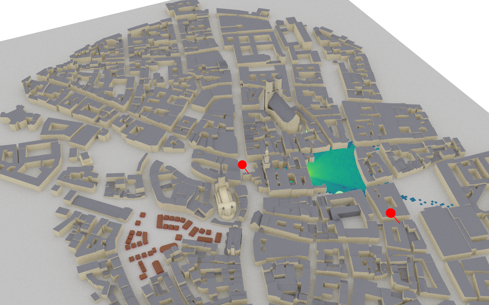
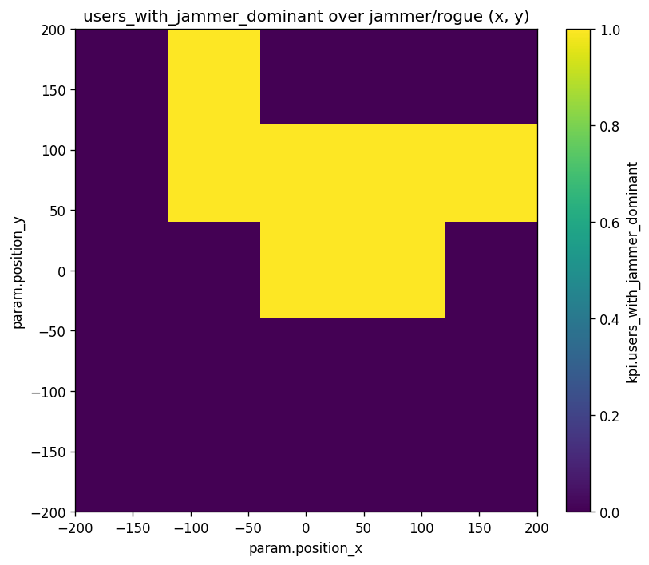
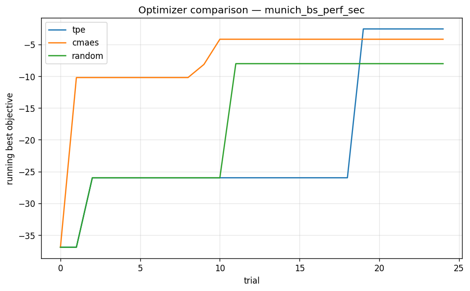

# Wireless-Sec-Sim

> A 3D AI-driven platform for **designing and securing** next-generation wireless networks.

`wireless-sec-sim` simulates wireless networks in real city geometry (via Sionna RT ray tracing), injects adversaries (jammers, rogue gNBs, eavesdroppers), and uses ML and Bayesian optimization to detect attacks and design deployments that resist them. Every numerical claim is reproducible from a single `make repro`.

| Same scene, no adversary | Same scene, +50 dBm jammer at centre |
|---|---|
|  |  |

For methodology and full results, see [`docs/TECHNICAL_REPORT.md`](docs/TECHNICAL_REPORT.md).

---

## Run it

```bash
make setup        # create venv + install requirements.txt   (~3 min)
make repro        # run every phase end-to-end on Munich    (~5–10 min on RTX 2060)
```

`make repro` runs the eight phases in order: load the 3D scene → simulate baseline + adversarial scenarios → sweep jammer/rogue positions → train classifier + coverage regressor → ingest into vector store → optimize deployment → smoke-test the dashboard → write a validation report.

GPU is optional. The CPU LLVM backend works everywhere; for GPU set `SIM_VARIANT=cuda_ad_mono_polarized` (requires `libnvoptix.so.1`).

Other useful targets:

```bash
make help        # list everything
make phase2      # just the reference scenarios (baseline, jammed, rogue, FSPL)
make phase3      # just the parameter sweeps
make phase6      # just the optimization studies
make validate    # cross-phase numerical checks (FSPL, classifier, retrieval, …)
make test        # full pytest suite (38 tests)
make clean       # delete everything under data/
```

To run something à la carte instead of via `make`:

```bash
python -m scripts.run_scenario     configs/munich_jammed.yaml
python -m scripts.run_sweep        configs/sweeps/jammer_position.yaml
python -m scripts.optimize_deployment configs/studies/munich_bs_perf_sec.yaml
python -m scripts.find_similar     data/runs/munich_jammed --embedder data/embedders/v1 --store data/vector_store --k 5
python -m scripts.predict_attack   data/runs/munich_jammed --model data/models/security_clf_v1
```

---

## Analyze the results

### The dashboard (recommended)

```bash
streamlit run services/dashboard/Home.py
# or:    python -m scripts.dashboard
```

Four pages over the `data/` artefacts:

- **Run Browser** — pick any run; see its 3D path-traced views, KPI strip (median SINR, attack flags), per-RX summary, full per-link table, scenario JSON.
- **Sweep Results** — pick a sweep; see attack-zone heatmaps, the SINR distribution, the full summary parquet, and an interactive `kpi.* vs param.*` scatter.
- **Similar Scenarios** — pick a query run; see its k nearest past scenarios with side-by-side 3D views.
- **Optimization Studies** — pick a study; see convergence trace, best parameters/KPIs, and the full trial table.

### The artefacts on disk

| Question | Look at |
|---|---|
| What did one scenario produce? | `data/runs/<name>/` — `scenario.json`, `kpis.json`, `per_link.parquet`, `radio_map.npz/png`, `view_*.png` (3D renders), `meta.json` |
| What's the attack-zone shape? | `data/sweeps/<name>/plot_xy_*.png` (e.g., `users_with_jammer_dominant`) |
| Did the classifier train well? | `data/models/security_clf_v1/metrics.json` |
| How accurate is the path-gain regressor? | `data/models/coverage_predictor_v1/metrics.json` |
| Which past scenarios are similar to this one? | `python -m scripts.find_similar <run_dir> --embedder data/embedders/v1 --store data/vector_store` |
| Where should I place this BS to maximise SINR under a jammer? | `data/studies/munich_bs_perf_sec/best.json` + `plot_convergence.png` |
| Did everything reproduce correctly? | `make validate` → `data/validation/report.json` |

### Quick inspection commands

```bash
# Aggregate KPIs of a run
python -c "import json; print(json.dumps(json.load(open('data/runs/munich_jammed/kpis.json'))['aggregate'], indent=2))"

# Sweep summary table
python -c "import pandas as pd; print(pd.read_parquet('data/sweeps/jammer_position/summary.parquet').to_string())"

# Best parameters of an optimization study
python -c "import json; print(json.dumps(json.load(open('data/studies/munich_bs_perf_sec/best.json')), indent=2))"
```

---

## What you get out of it

Examples of the kinds of analysis the platform produces (after `make repro`):

|  |  |
|---|---|
| Rogue gNB footprint isolated in 3D — where the attacker captures UEs | 25-run jammer-position sweep — where the jammer is effective vs. wasted |

|  |
|---|
| TPE vs CMA-ES vs random on the joint perf+security study (same trial budget, same seed) — TPE recovers +17.4 dB SINR vs −16.9 dB baseline collapse under the same jammer. |

For full methodology, validation against analytical baselines, results tables, limitations, and future work, see [`docs/TECHNICAL_REPORT.md`](docs/TECHNICAL_REPORT.md).
